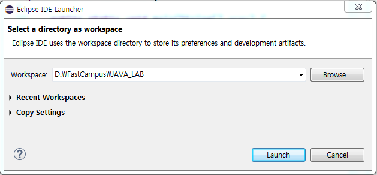
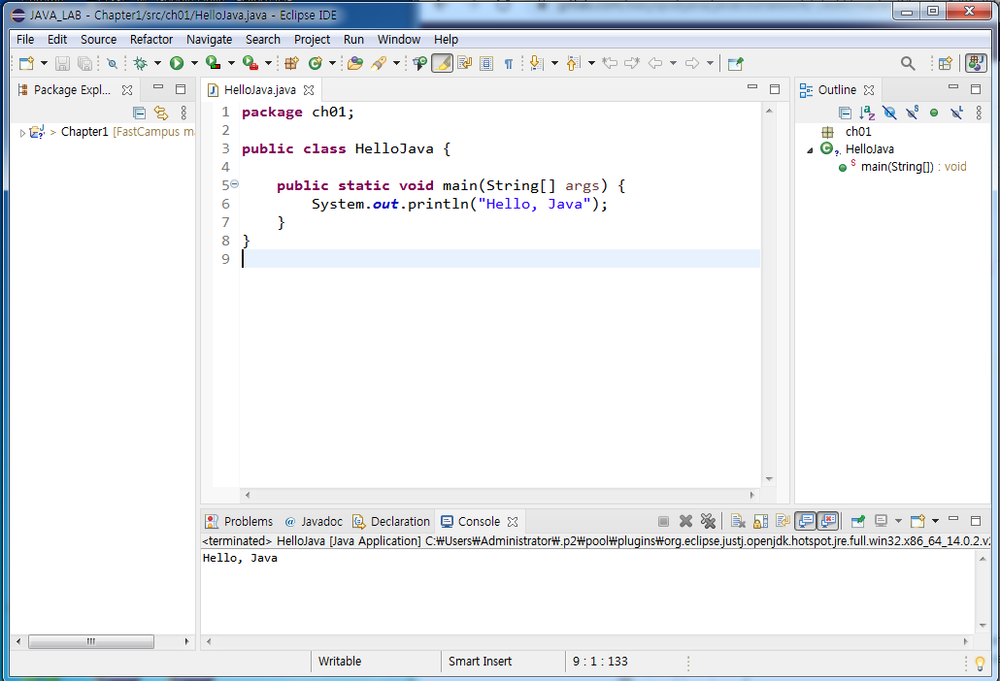

# 03. 자바 첫 프로그램 만들고 실행하기

## 이클립스 실행하기

 * WorkSpace 설정
 
   

 * 프로젝트 만들기와 화면의 구성

   


## 첫 프로그램 "Hello, Java" 출력하기

```
package ch01;

public class HelloJava {

	public static void main(String[] args) {
		System.out.println("Hello, Java");
	}
}
```


## 다음
[04. 컴퓨터에서 자료 표현하기](https://github.com/Domo9610/Java/tree/main/Java_Course_work/Chapter1/01-04/README.md)

## 돌아가기
[목차](https://github.com/Domo9610/Java/blob/main/Java_Course_work/Chapter1/README.md)
